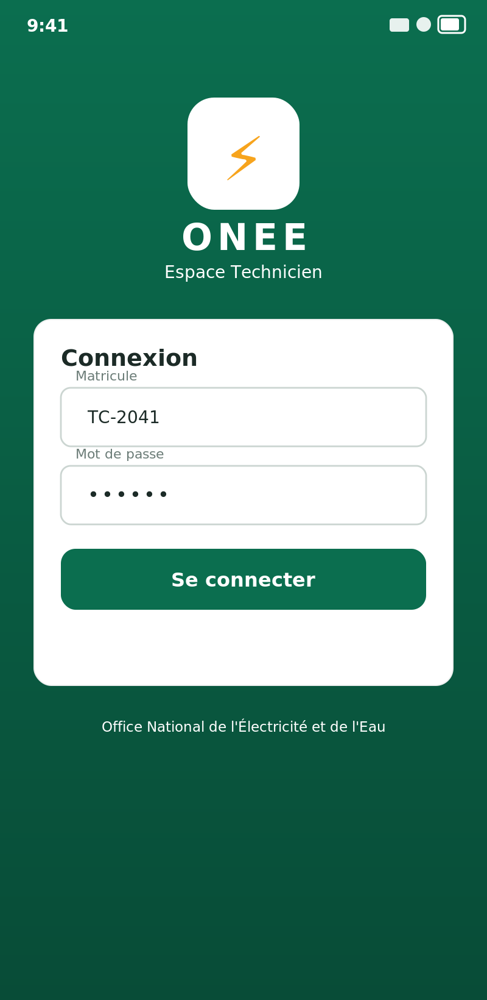
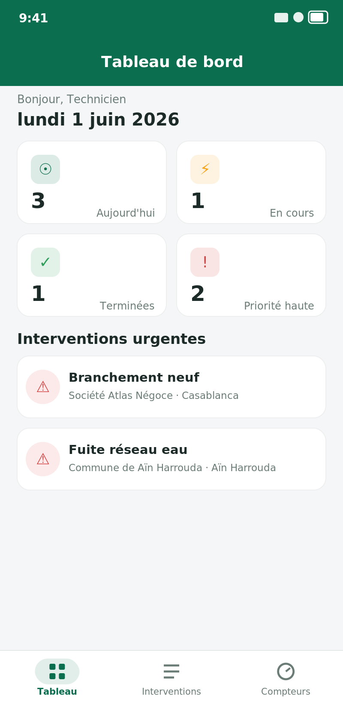
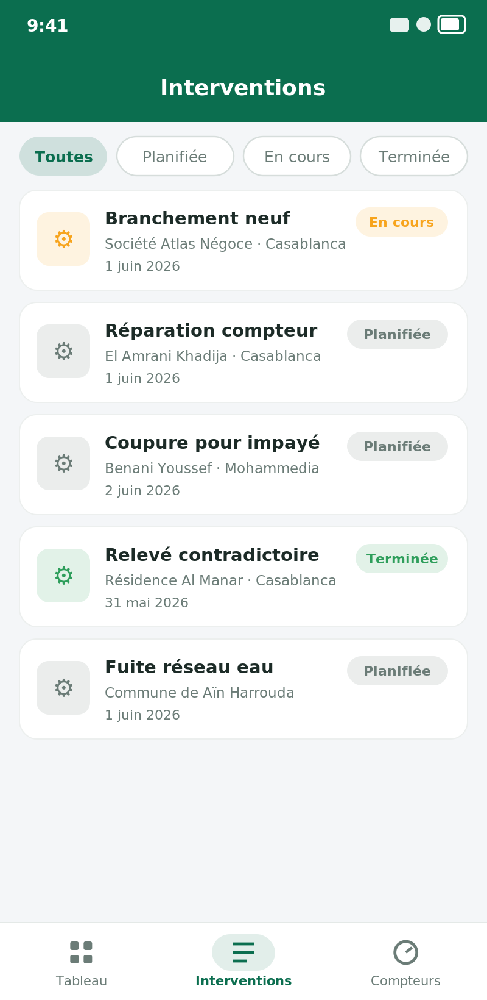
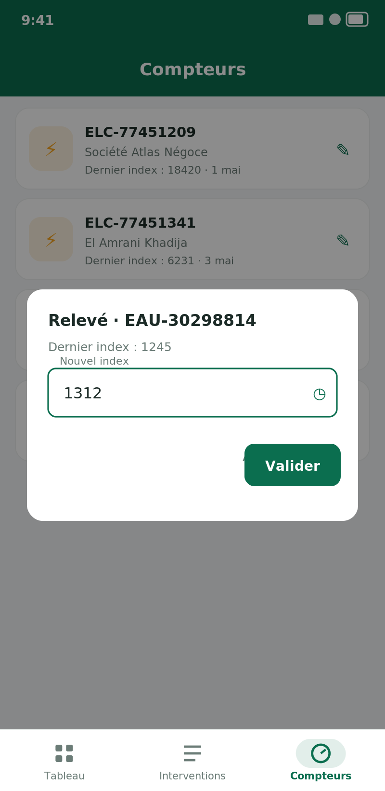

# ONEE Technicien — Application mobile Flutter

Application mobile destinée aux **techniciens de l'ONEE** (Office National de l'Électricité et de l'Eau) pour gérer leurs **interventions terrain** et la **saisie des relevés de compteurs**, conçue lors d'un stage.

Développée en **Flutter / Dart**, avec une couche service prête à se brancher sur un backend REST (et un mode démo hors-ligne intégré pour pouvoir lancer l'app sans serveur).

Projet de **Badr Chigar** — Ingénieur d'État en Informatique (EMSI Casablanca).

## Captures d'écran

| Connexion | Tableau de bord |
|:---:|:---:|
|  |  |

| Interventions | Relevé de compteur |
|:---:|:---:|
|  |  |

## Fonctionnalités

- **Authentification** par matricule technicien (jeton Bearer côté API).
- **Tableau de bord** : interventions du jour, en cours, terminées, et compteur des priorités hautes ; liste des interventions urgentes.
- **Interventions** : liste filtrable par statut (Planifiée / En cours / Terminée), fiche détaillée en bottom-sheet (client, adresse, date, priorité, note) avec clôture en un geste.
- **Compteurs** : liste des compteurs électricité / eau, **saisie du nouvel index** avec calcul automatique de la consommation.
- **Mode terrain hors-ligne** : si le backend n'est pas joignable, le service bascule sur un jeu de données de démonstration pour rester utilisable.

## Stack technique

| Élément | Détail |
|---|---|
| Langage | Dart |
| Framework | Flutter (Material 3) |
| Réseau | `package:http` (REST, jeton Bearer) |
| Dates / i18n | `package:intl` (locale `fr_FR`) |
| Architecture | écrans (`screens/`), modèles (`models/`), service API (`services/`), widgets réutilisables (`widgets/`) |

## Structure du projet

```
onee/
├── pubspec.yaml
├── lib/
│   ├── main.dart                 thème ONEE + point d'entrée
│   ├── models/
│   │   ├── intervention.dart      modèle + enum de statut
│   │   └── compteur.dart          compteur + relevé
│   ├── services/
│   │   └── api_service.dart       appels REST + fallback démo
│   ├── widgets/
│   │   └── stat_card.dart         carte de statistique
│   └── screens/
│       ├── login_screen.dart
│       ├── home_screen.dart       navigation (bottom bar)
│       ├── dashboard_screen.dart
│       ├── interventions_screen.dart
│       └── compteurs_screen.dart
└── test/
    └── widget_test.dart           tests unitaires des modèles
```

## Lancer le projet

```bash
flutter pub get
flutter run            # appareil/émulateur Android ou iOS
flutter test           # tests unitaires
```

Par défaut l'app fonctionne en **mode démo** (aucun backend requis). Pour la brancher sur un vrai serveur, renseigner l'URL dans `ApiService(baseUrl: 'https://...')`.

## Licence

MIT © Badr Chigar
